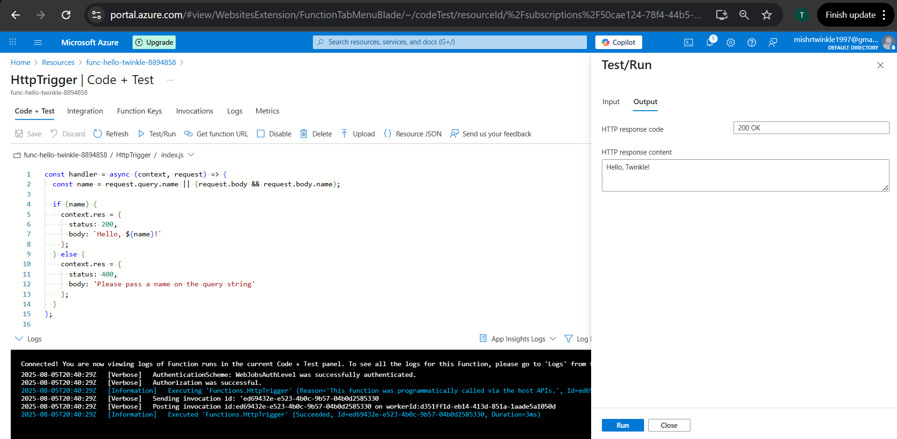
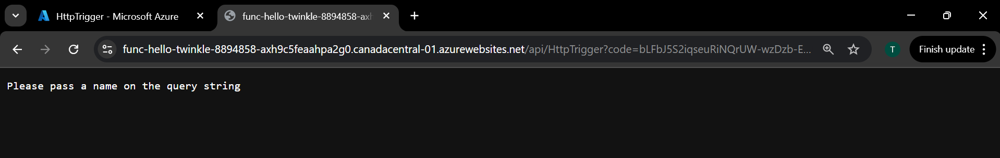

# Jenkins CI/CD Pipeline for Azure Function App

This project demonstrates an automated CI/CD pipeline using Jenkins to deploy a Node.js-based Azure Function App.

## Project Structure

```
A3-JENKINS-CI-CD-PIPELINE
│
├── src/functions/HttpTrigger.js        # Azure Function logic
├── tests/function.test.js              # Unit tests
├── Jenkinsfile                         # Jenkins CI/CD pipeline definition
├── package.json / package-lock.json    # Project metadata and dependencies
├── local.settings.json / host.json     # Azure Function configurations
├── .funcignore / .gitignore            # Ignore files for deployment and git
└── screenshots/                        # Evidence of each step in the pipeline
```

## Pipeline Stages

1. **Checkout** - Clones the GitHub repository.
2. **Install Dependencies** - Installs npm packages.
3. **Run Tests** - Runs automated unit tests using Jest.
4. **Package Function App** - Compresses the function files.
5. **Deploy to Azure** - Deploys using Azure CLI and Service Principal credentials.
6. **Post Actions** - Logs pipeline status (success or failure).

## Environment Configuration

Jenkins global credentials are used to securely store the following environment variables:
- `AZURE_CLIENT_ID`
- `AZURE_CLIENT_SECRET`
- `AZURE_TENANT_ID`
- `AZURE_SUBSCRIPTION_ID`

These are injected into the pipeline to authenticate Azure CLI.

## Function URL

Once deployed, the function is accessible via the Azure URL, example:
```
https://<your-function-name>.azurewebsites.net/api/HttpTrigger?code=***REDACTED***

```

## Screenshots

All key stages of the Jenkins CI/CD pipeline and Azure Function deployment are shown below:

### Azure Function App Created


### Azure Function Resource Group


### Azure Code Editor


### Azure Test Run Output


### Jenkins Dashboard Pipeline Success


### Pipeline Success Overview


### Jenkins Stage Checkout


### Jenkins Stage Install Dependencies


### Jenkins Stage Run Tests


### Jenkins Stage Package Function


### Jenkins Stage Deploy To Azure


### Jenkins Stage Verify Deployment


### Jenkins Environment Variable Config


### Browser Function Default Message


### Browser Function Response


## Outcome

- Azure Function deployed successfully and accessible via HTTP endpoint.
- Jenkins pipeline verified across all stages.

## Author

- Twinkle Mishra 
- 8894858
